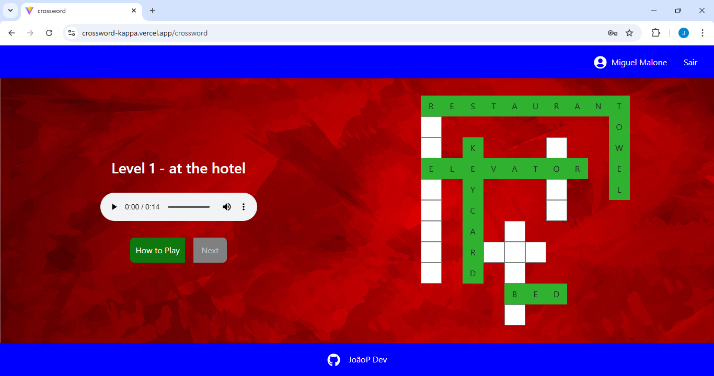
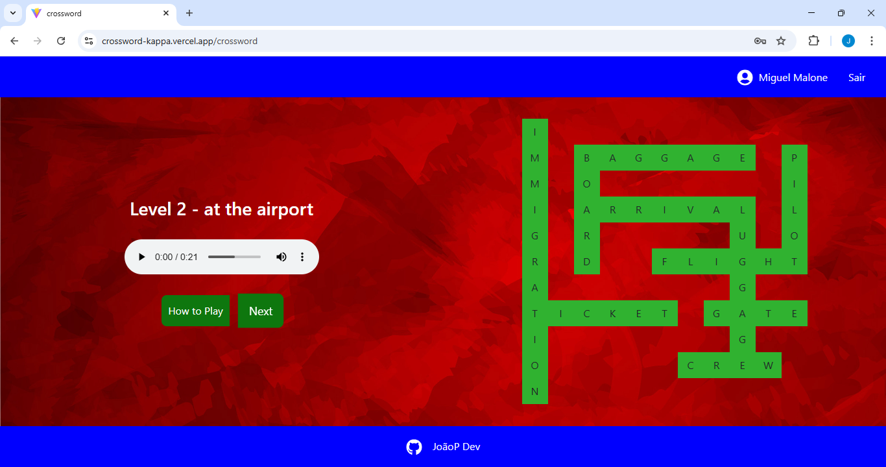
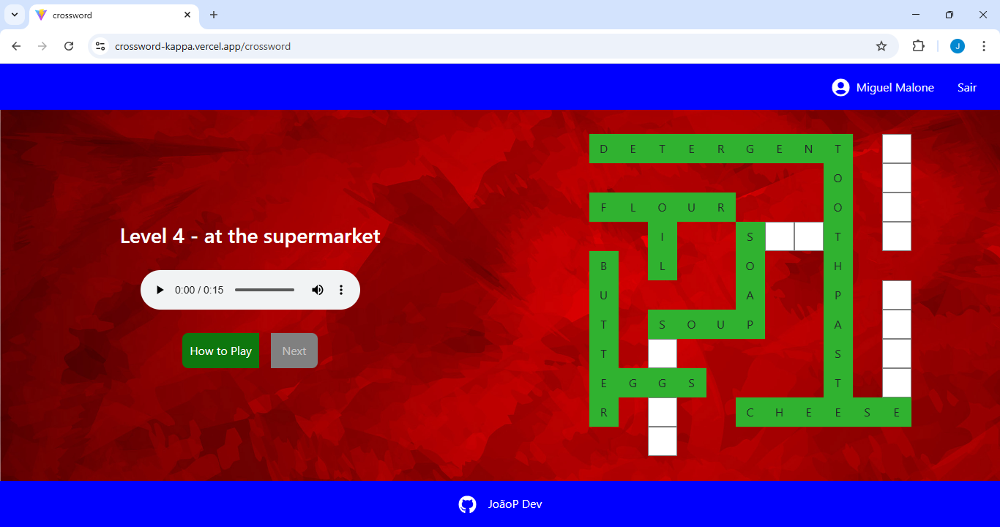
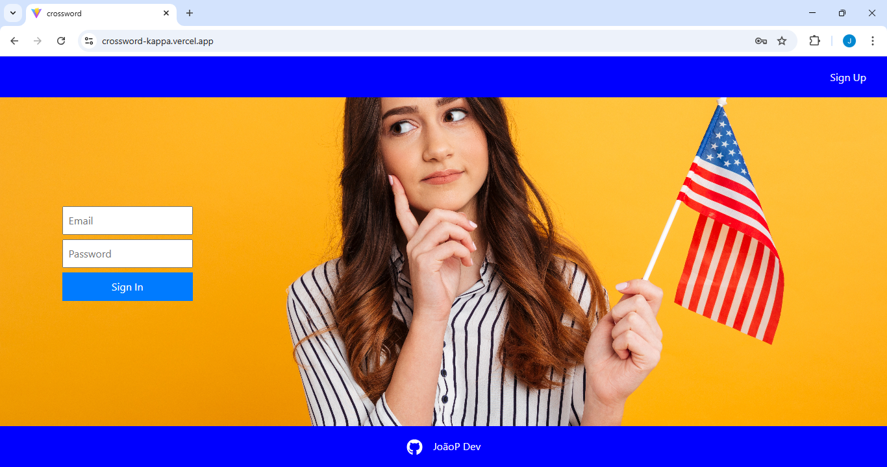
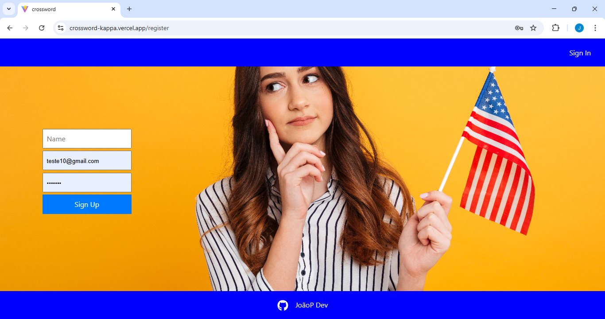

# Crossword Game

Este projeto é um jogo de palavras cruzadas desenvolvido para demonstrar habilidades full-stack em uma aplicação web real. Ele faz parte de uma plataforma maior para ensino de inglês utilizando músicas, filmes, séries e jogos.

## Demonstração

Acesse o projeto funcionando: [crossword-kappa.vercel.app](https://crossword-kappa.vercel.app)

---

## Sobre o Projeto

- Backend completo com arquitetura MVC
- API REST desenvolvida em Node.js + Express
- Autenticação com JWT
- Banco de dados MongoDB para persistência
- Níveis de jogo variados
- Interface responsiva

---

## Tecnologias Utilizadas

### Frontend

- React
- Vite
- CSS

### Backend

- Node.js
- Express
- MongoDB

---

## Como executar este projeto localmente

> **Requisito:** É necessário ter o [Node.js](https://nodejs.org/) e o [MongoDB Atlas](https://www.mongodb.com/atlas/database) (ou outro MongoDB funcional).

1. **Clone este repositório:**

   ```bash
   git clone https://github.com/JoaoPMV/crossword.git
   cd crossword
   ```

2. **Configure as variáveis de ambiente do backend:**

   Crie um arquivo `.env` dentro de `crossword-backend` seguindo o modelo abaixo:

   ```
   MONGO_URI=sua_string_de_conexao
   JWT_SECRET=sua_chave_secreta
   ```

3. **Inicie o backend (API):**

   ```bash
   cd crossword-backend
   npm install
   npm run dev
   ```

   - O backend será executado em [http://localhost:5000](http://localhost:5000)
   - Mensagem esperada no terminal:
     ```
     Rotas de jogos carregadas com sucesso
     Servidor rodando localmente.
     Conectado ao MongoDB com sucesso!
     ```

4. **Inicie o frontend (interface):**

   Abra um novo terminal, navegue até a pasta do projeto, e rode:

   ```bash
   cd crossword-frontend
   npm install
   npm run dev
   ```

   - O frontend estará disponível em [http://localhost:3000](http://localhost:3000).
   - Mensagem esperada:
     ```
     VITE v7.2.7 ready in XXX ms
     ➜ Local:   http://localhost:3000/
     ➜ Network: http://192.168.1.2:3000/
     ```

5. **Acesse [http://localhost:3000](http://localhost:3000) no navegador.**

   > **Atenção:** Mantenha backend e frontend rodando ao mesmo tempo!

---

## 📂 Estrutura do Projeto

```
crossword/
├── crossword-frontend/
│   ├── .gitignore
│   ├── README.md
│   ├── eslint.config.js
│   ├── index.html
│   ├── package.json
│   ├── package-lock.json
│   ├── vite.config.js
│   ├── vercel.json
│   ├── public/
│   ├── dist/
│   └── src/
│       ├── components/        # Componentes React
│       ├── App.jsx
│       └── index.css
├── crossword-backend/
│   ├── .gitignore
│   ├── app.js                # Inicialização do backend
│   ├── package.json
│   ├── package-lock.json
│   ├── vercel.json
│   ├── config/               # Configuração de ambiente/conexão
│   ├── controllers/          # Lógica dos controladores
│   ├── middlewares/          # Middlewares Express
│   ├── models/               # Modelos do MongoDB
│   ├── routes/               # Rotas da API
│   ├── seeders/              # (Opcional) Seed de dados
│   └── services/             # Serviços auxiliares
```

## 📸 Screenshots

### Nível 1 do Jogo



### Nível 2 do Jogo



### Nível 4 do Jogo



### Tela de Login



### Tela de Cadastro



---

## Licença

Licença: MIT

---

**Contato:**

- [João Paulo Martins Vieira](https://www.linkedin.com/in/jo%C3%A3o-paulo-martins-vieira-4a0a5114a/)
